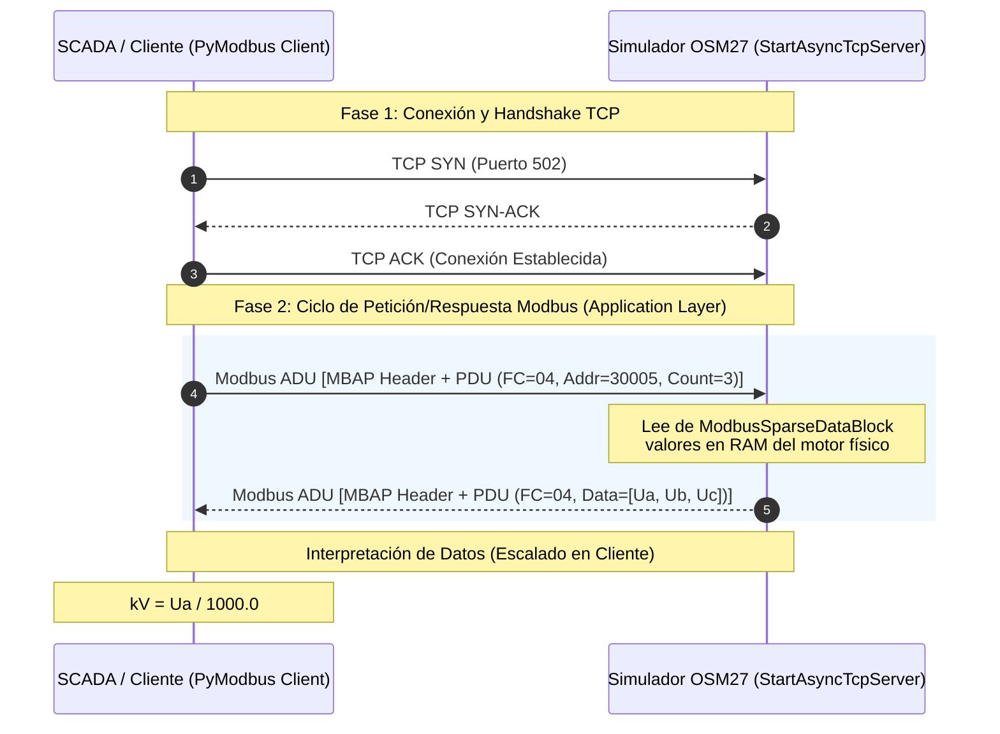

# Análisis de Estructura de Proyecto y Protocolo Modbus TCP: Simulador NOJA OSM27

Este documento presenta una auditoría y análisis técnico detallado sobre el funcionamiento de cada archivo en el espacio de trabajo del simulador **NOJA Power OSM27** (con controlador de reconectador RC10) y explica cómo se implementa el protocolo **Modbus TCP** tanto a nivel de servidor (simulador) como de cliente (consola y Qt).

---

## 1. Estructura del Directorio y Rol de cada Archivo

El proyecto está diseñado de forma modular, separando la lógica física/eléctrica de la red, la asignación de memoria industrial y las interfaces de visualización (clientes).

### 📂 Carpeta `/simulador_osm27`
Esta carpeta contiene el núcleo lógico y físico del servidor del reconectador.

*   **[`main.py`](file:///home/benja/Escritorio/UNI/Quinto/AplicacionesTCP_IP/TRABAJO_FINAL/Proyecto/Proyecto_OSM27/simulador_osm27/main.py)**:
    *   **Función principal**: Es el punto de entrada del simulador. Ejecuta concurrentemente mediante `asyncio` tres componentes críticos:
        1.  El **servidor Modbus TCP** (`StartAsyncTcpServer` de PyModbus) escuchando en la IP `0.0.0.0` en el puerto industrial `502`.
        2.  Un **servidor API REST** (`FastAPI` ejecutado en Uvicorn) que escucha en el puerto `8000` para recibir inyecciones externas de anomalías eléctricas (falla transitoria, falla permanente, sags de tensión, resets).
        3.  El **motor matemático** (`motor_matematico`), un bucle asíncrono que corre cada $1\text{ s}$ simulando variables analógicas (tensiones con ruido gaussiano/AWGN, cálculo de potencias, acumuladores de energía) y estados físicos. Luego, actualiza estas variables en tiempo real en los registros Modbus correspondientes a través de la función `setValues()`.
        4.  Un **demonio worker de notificaciones** que procesa la cola de alertas y fallas simuladas.

*   **[`datastore.py`](file:///home/benja/Escritorio/UNI/Quinto/AplicacionesTCP_IP/TRABAJO_FINAL/Proyecto/Proyecto_OSM27/simulador_osm27/datastore.py)**:
    *   **Función principal**: Define el mapa de memoria Modbus simulado. Modela los registros del controlador industrial RC10 mediante `ModbusSparseDataBlock`. 
    *   **Por qué es clave**: En lugar de usar bloques de datos continuos por defecto (lo cual consumiría mucha memoria innecesaria), emplea bloques *dispersos* (`Sparse`), permitiendo registrar direcciones exactas discontinuas que coinciden con los estándares reales de NOJA (como `10001`, `30005`, `40001`). Organiza la memoria en tres tablas:
        *   **Discrete Inputs (Entradas Discretas - solo lectura, tipo `2` en PyModbus)**: Direcciones de estado como lockout (`10001`), pickup de sobrecorriente (`10010`), estado abierto (`10035`), alarma de tensión (`10040`), alarma general (`10064`) y estado cerrado (`10075`).
        *   **Input Registers (Registros de Entrada - analógicos de solo lectura, tipo `4` en PyModbus)**: Direcciones de variables de corriente (`30001-30003`), tensiones de fase (`30005-30007`), tensiones compuestas (`30011-30013`), potencias trifásicas (`30026-30028`), acumuladores de energía de 32 bits (`30041-30044`), frecuencia (`30061`), factor de potencia (`30068`) y contador de aperturas (`30075`).
        *   **Holding Registers (Registros de Retención - lectura/escritura, tipo `3` en PyModbus)**: Direcciones de ajuste del equipo, como el reloj Unix dividido en dos partes (`40001-40002`), tiempo muerto de reenganche (`40003`) e intentos máximos (`40005`).

*   **[`estado.py`](file:///home/benja/Escritorio/UNI/Quinto/AplicacionesTCP_IP/TRABAJO_FINAL/Proyecto/Proyecto_OSM27/simulador_osm27/estado.py)**:
    *   **Función principal**: Implementa la clase `EstadoSimulador` que modela la lógica física y eléctrica real de la subestación.
    *   **Lógica de Reenganche (ANSI 79)**: Contiene una Máquina de Estados Finitos (FSM) que controla la secuencia de reconexión automática tras un disparo por sobrecorriente. Maneja los estados `CERRADO`, `ESPERA` (tiempo muerto asíncrono para dar oportunidad a que se extinga una falla transitoria) y `BLOQUEO` (Lockout, si los intentos se agotan debido a una falla permanente).
    *   **Perturbaciones**: Modela el perfil dinámico de carga según la hora del día, el desvanecimiento de tensión (*sag* o hueco de tensión debido a arranques de grandes cargas) e inyección de fallas eléctricas de forma dinámica.

---

### 📂 Carpeta `/app_cliente_qt`
Esta carpeta aloja una aplicación cliente de escritorio con interfaz gráfica premium de tipo SCADA.

*   **[`main_window.py`](file:///home/benja/Escritorio/UNI/Quinto/AplicacionesTCP_IP/TRABAJO_FINAL/Proyecto/Proyecto_OSM27/app_cliente_qt/main_window.py)**:
    *   **Función principal**: Arranca la GUI desarrollada en PyQt5 cargando el archivo de interfaz de usuario (`panel.ui`).
    *   **Implementación de Multihilo**: Para evitar que la interfaz de usuario se congele (lo cual arruinaría la experiencia premium), separa el tráfico de datos y la GUI:
        *   **Hilo de Fondo (`WorkerModbus`)**: Hereda de `QThread`. Contiene un cliente Modbus TCP síncrono estándar (`ModbusTcpClient`) que hace *polling* (consulta activa) cada $1\text{ s}$ al servidor local en el puerto `502`. Específicamente solicita las tres tensiones de fase (registro base `30005`, cantidad `3`). Una vez leídas con éxito, envía los datos en un diccionario al hilo principal mediante una señal `pyqtSignal`.
        *   **Hilo Principal (`VentanaSCADA`)**: Recibe la señal con las tensiones, aplica formato de coma flotante y las dibuja instantáneamente en los controles LCD de la ventana. Aplica además un estilo moderno tipo Dark Industrial mediante hojas de estilo QSS.
*   **[`panel.ui`](file:///home/benja/Escritorio/UNI/Quinto/AplicacionesTCP_IP/TRABAJO_FINAL/Proyecto/Proyecto_OSM27/app_cliente_qt/panel.ui)**:
    *   **Función principal**: Es el archivo XML autogenerado por Qt Designer. Define la disposición visual de las etiquetas y pantallas LCD (`Ua`, `Ub`, `Uc`) utilizadas por la GUI.

---

### 📂 Archivos en el Directorio Raíz

*   **[`client_test.py`](file:///home/benja/Escritorio/UNI/Quinto/AplicacionesTCP_IP/TRABAJO_FINAL/Proyecto/Proyecto_OSM27/client_test.py)**:
    *   **Función principal**: Script simple de depuración para probar el correcto funcionamiento del socket TCP y el protocolo de aplicación Modbus. Utiliza el cliente asíncrono `AsyncModbusTcpClient` para conectarse a `127.0.0.1:502`, realizar la petición de la tensión `Ua` en el registro `30005` (Function Code 4), imprimir el valor crudo leído y el interpretado físico en kilovoltios (kV), y cerrar de forma limpia la conexión TCP.

*   **[`cliente_interactivo.py`](file:///home/benja/Escritorio/UNI/Quinto/AplicacionesTCP_IP/TRABAJO_FINAL/Proyecto/Proyecto_OSM27/cliente_interactivo.py)**:
    *   **Función principal**: Un SCADA interactivo de consola extremadamente completo.
    *   **Lógica asíncrona dual**:
        *   **Tarea de Lectura Modbus (`tarea_modbus`)**: Conectado a través del cliente asíncrono, realiza múltiples lecturas en paralelo a la memoria del simulador. Extrae y formatea toda la telemetría del equipo (estados de interruptor por bit discreto, corrientes, tensiones, potencias de 16 bits, energías de 32 bits a partir de dos registros adyacentes, y la fecha/hora en Unix Timestamp convertida a formato legible). Muestra los estados y alarmas mediante caracteres ANSI de colores simulando luces LED piloto (`⬤` y `◯`).
        *   **Tarea de Teclado (`tarea_teclado`)**: Bucle que escucha los comandos introducidos por el usuario de forma no bloqueante utilizando ejecutores asíncronos (`run_in_executor`). Cuando el usuario digita un comando (como fallas o resets), el cliente realiza una petición HTTP POST asíncrona (usando `httpx`) hacia la API del simulador en el puerto `8000` para inyectar la anomalía. También permite simular un "Corte de Cable TCP" (desactivando temporalmente las consultas Modbus en el SCADA).

---

## 2. Cómo se Implementa el Protocolo Modbus TCP

Modbus TCP es un protocolo de comunicación industrial de capa de aplicación, que encapsula las tramas tradicionales de Modbus RTU en sockets TCP estándar sobre el puerto predeterminado **502**. A continuación se detalla exactamente cómo se implementa a nivel del software:



### 2.1 El Servidor (El Simulador OSM27)

El simulador implementa el protocolo sirviéndose de la biblioteca `pymodbus.server`:

1.  **Carga del Mapa de Memoria (Data Block Disperso)**:
    En `datastore.py`, se definen bloques de tipo `ModbusSparseDataBlock`. Esto permite crear una representación virtual de la RAM del controlador. Modbus clasifica los datos por tipos y funciones. En el código:
    ```python
    device_context = ModbusSlaveContext(di=bloque_di, co=None, hr=bloque_hr, ir=bloque_ir)
    server_context = ModbusServerContext(device_context, single=True)
    ```
    *   `di` representa **Discrete Inputs** (Entradas Discretas, lecturas de bits/binarios). Modbus TCP las lee usando el **Código de Función 02 (Read Discrete Inputs)**.
    *   `ir` representa **Input Registers** (Registros de Entrada, analógicos de solo lectura de 16 bits). Se leen usando el **Código de Función 04 (Read Input Registers)**.
    *   `hr` representa **Holding Registers** (Registros de Retención, analógicos de lectura/escritura de 16 bits). Se leen con el **Código de Función 03 (Read Holding Registers)** y se escriben con el **Código de Función 06 o 16**.
    *   El parámetro `single=True` en `ModbusServerContext` le indica al servidor que ignore el identificador de esclavo (`Unit ID` / `device_id`) y redirija todas las solicitudes al mismo contexto, simplificando la integración.

2.  **Lanzamiento del Servidor TCP**:
    En `main.py`, la llamada asíncrona inicializa el socket TCP y el protocolo de enlace:
    ```python
    servidor_modbus = StartAsyncTcpServer(context=contexto_servidor, address=("0.0.0.0", 502))
    ```
    Esto levanta el puerto `502`. Cuando un cliente se conecta, se realiza el saludo TCP de tres vías estándar (`SYN`, `SYN-ACK`, `ACK`). El servidor mantiene la conexión persistente esperando tramas de aplicación Modbus TCP.

3.  **Actualización Dinámica de los Registros**:
    A medida que el motor matemático calcula nuevos valores eléctricos (por ejemplo, corriente con ruido térmico, incremento en la energía integrada, o activación de la FSM de protección), el servidor escribe directamente a su mapa de RAM virtual:
    ```python
    esclavo.setValues(4, 30005, [c16(ua), c16(ub), c16(uc)])
    ```
    *   El primer argumento (`4`) define la tabla Modbus (Registros de Entrada / `ir`).
    *   El segundo argumento (`30005`) es la dirección de inicio del registro.
    *   El tercer argumento es una lista de valores enteros de 16 bits. La función auxiliar `c16()` previene el desbordamiento forzando que el valor resida estrictamente entre `0` y `65535` ($2^{16}-1$).

---

### 2.2 Los Clientes (Interactive SCADA & Qt)

Los clientes implementan el protocolo Modbus TCP realizando consultas cíclicas (polling) al puerto `502` del servidor y decodificando las tramas recibidas:

1.  **Conexión**:
    *   En Python síncrono (`main_window.py`):
        ```python
        cliente = ModbusTcpClient('127.0.0.1', port=502)
        cliente.connect()
        ```
    *   En Python asíncrono (`cliente_interactivo.py`):
        ```python
        cliente = AsyncModbusTcpClient('127.0.0.1', port=502)
        await cliente.connect()
        ```

2.  **Solicitud de Tramas de Datos (Peticiones Modbus TCP)**:
    Una trama Modbus TCP (conocida como **ADU - Application Data Unit**) incluye una cabecera de cabecera TCP específica (**MBAP Header** de 7 bytes) seguida de la **PDU** (Protocol Data Unit: Código de Función + Datos).
    Cuando el cliente interactivo ejecuta:
    ```python
    r_v = await cliente.read_input_registers(30005, 3, slave=1)
    ```
    Envía una trama solicitando **3 registros** comenzando en la dirección **30005** a través de la función **04** (lectura de registros analógicos de entrada).

3.  **Decodificación e Interpretación de Datos (Tipificación)**:
    Dado que las tramas Modbus TCP transportan de forma nativa únicamente enteros sin signo de 16 bits, el cliente debe interpretar estos datos crudos para reconstruir los tipos de datos reales y magnitudes físicas:

    *   **Escalado de Tensión**:
        El simulador guarda la tensión en voltios (p. ej., `13200` V). El cliente recupera este entero, lo divide entre `1000.0` y obtiene un número flotante en kilovoltios (`13.2` kV) para visualización:
        ```python
        datos_ui["ua"] = r_v.registers[0] / 1000.0
        ```
    *   **Escalado de Frecuencia y Factor de Potencia**:
        La frecuencia se almacena multiplicada por 100 (ej. `5002` para indicar $50.02\text{ Hz}$). El cliente la divide por `100.0`.
        El factor de potencia se almacena multiplicado por 1000 (ej. `950` para indicar $0.950$). Se divide por `1000.0`.

    *   **Mapeo de Variables de 32 bits (Energía y Tiempo)**:
        Para variables de 32 bits (como acumuladores de energía en kWh o timestamps de Unix), se requiere unir dos registros contiguos de 16 bits.
        *   **En el servidor**: Se desplaza a la derecha 16 bits para guardar la parte alta, y se hace una máscara lógica con `0xFFFF` para la parte baja:
            ```python
            esclavo.setValues(4, 30041, [(e_act >> 16) & 0xFFFF, e_act & 0xFFFF])
            ```
        *   **En el cliente**: Se vuelve a ensamblar el número desplazando el primer registro a la izquierda 16 bits y aplicando un operador `OR` binario con el segundo:
            ```python
            datos_ui["energia_act"] = (r_e1.registers[0] << 16) | r_e1.registers[1]
            ```

    *   **Lectura de Estados Discretos**:
        Los bits booleanos de alarma o posición se leen utilizando el código de función **02**:
        ```python
        r_blk = await cliente.read_discrete_inputs(10001, 1, slave=1)
        datos_ui["bloqueo"] = r_blk.bits[0] # bits[0] contiene True (1) o False (0)
        ```

4.  **Cierre de Socket**:
    Para evitar el agotamiento de sockets en el kernel del sistema operativo y errores de reconexión, los clientes cierran de manera limpia la conexión al salir de la aplicación mediante `cliente.close()`.

---

## 3. Resumen de Flujos y Mapeo Completo de Registros

A modo de referencia rápida, esta es la distribución completa mapeada en el protocolo Modbus TCP en este simulador:

| Dirección Modbus | Tipo de Registro | Dirección Física Real | Tipo de Dato | Variable / Significado | Escalado / Conversión |
| :--- | :--- | :--- | :--- | :--- | :--- |
| **10001** | Discrete Input (RO) | `0x2711` | Bit | Lockout (Bloqueo activo) | Booleano |
| **10010** | Discrete Input (RO) | `0x271A` | Bit | Pickup (Sobrecorriente transitoria) | Booleano |
| **10035** | Discrete Input (RO) | `0x2733` | Bit | Interruptor en posición ABIERTO | Booleano |
| **10040** | Discrete Input (RO) | `0x2738` | Bit | Sag (Hueco de tensión activo) | Booleano |
| **10064** | Discrete Input (RO) | `0x2750` | Bit | Alarma General activada | Booleano |
| **10075** | Discrete Input (RO) | `0x275B` | Bit | Interruptor en posición CERRADO | Booleano |
| **30001 - 30003** | Input Register (RO) | `0x7531 - 0x7533` | Word (16-bit) | Corriente de fases Ia, Ib, Ic | $1\text{ LSB} = 1\text{ A}$ |
| **30005 - 30007** | Input Register (RO) | `0x7535 - 0x7537` | Word (16-bit) | Tensión de fase Ua, Ub, Uc | $V = \text{Reg} / 1000.0\text{ kV}$ |
| **30011 - 30013** | Input Register (RO) | `0x753B - 0x753D` | Word (16-bit) | Tensión de línea Uab, Ubc, Uca | $V = \text{Reg} / 1000.0\text{ kV}$ |
| **30026 - 30028** | Input Register (RO) | `0x754A - 0x754C` | Word (16-bit) | Potencia Aparente (kVA), Reactiva (kVAr), Activa (kW) | $1\text{ LSB} = 1\text{ unit}$ |
| **30041 - 30042** | Input Register (RO) | `0x7559 - 0x755A` | DWord (32-bit) | Energía Activa Acumulada | Unificado de 2 registros (Hi/Lo) |
| **30043 - 30044** | Input Register (RO) | `0x755B - 0x755C` | DWord (32-bit) | Energía Reactiva Acumulada | Unificado de 2 registros (Hi/Lo) |
| **30061** | Input Register (RO) | `0x756D` | Word (16-bit) | Frecuencia de Red | $\text{Hz} = \text{Reg} / 100.0$ |
| **30068** | Input Register (RO) | `0x7574` | Word (16-bit) | Factor de Potencia (FP) | $\text{FP} = \text{Reg} / 1000.0$ |
| **30075** | Input Register (RO) | `0x757B` | Word (16-bit) | Contador de operaciones/aperturas | $1\text{ LSB} = 1\text{ disparo}$ |
| **40001 - 40002** | Holding Register (RW) | `0x9C41 - 0x9C42` | DWord (32-bit) | Reloj del Controlador (Unix Timestamp) | Unificado de 2 registros (Hi/Lo) |
| **40003** | Holding Register (RW) | `0x9C43` | Word (16-bit) | Reclosing Dead Time (Tiempo de espera) | $1\text{ LSB} = 1\text{ segundo}$ |
| **40005** | Holding Register (RW) | `0x9C45` | Word (16-bit) | Intentos máximos permitidos de reenganche | $1\text{ LSB} = 1\text{ intento}$ |
